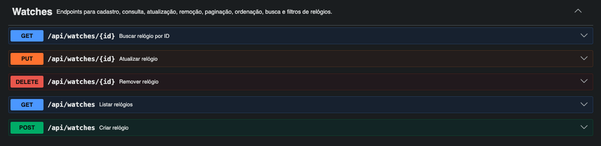
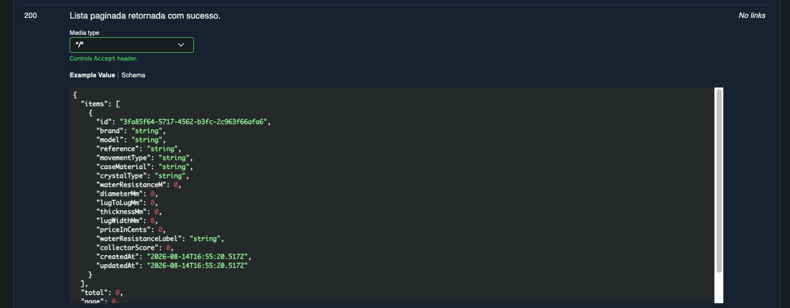
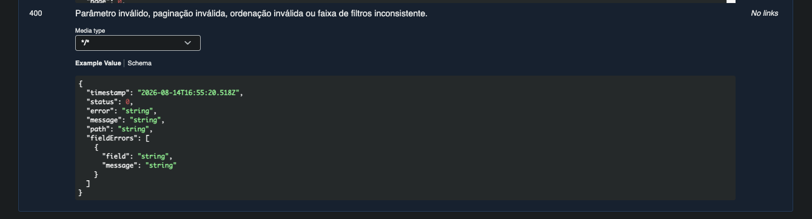
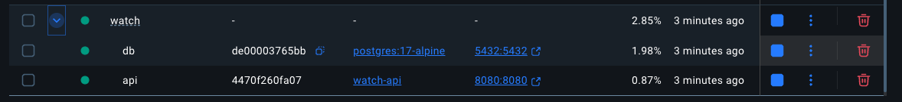

# Watch API - Desafio Backend Resolvido

API REST para controle de estoque de relógios, desenvolvida como solução completa de um desafio backend com **Spring Boot**, **PostgreSQL**, **JPA Specifications**, **Docker** e **Swagger/OpenAPI**.

O projeto implementa uma arquitetura em camadas tradicional, com foco em clareza, validação de entrada, tratamento global de erros, filtros combináveis e uma experiência de execução simples para avaliação técnica.

## Destaques

- CRUD completo de relógios
- Paginação com limite máximo por página
- Ordenação por data, preço, diâmetro e resistência à água
- Busca textual em marca, modelo e referência
- Filtros combináveis com `JpaSpecificationExecutor`
- DTOs com `record`
- Mapper manual com campos calculados
- Enums com conversão `fromApi()` e `toApi()`
- Validação com Bean Validation
- Tratamento global de erros com `@RestControllerAdvice`
- Documentação Swagger/OpenAPI detalhada
- Ambiente com Docker Compose: API + PostgreSQL
- Makefile para padronizar execução local e via Docker

## Preview

### Swagger UI



### Resposta de sucesso



### Resposta de erro padronizada



### Containers Docker em execução



## Tecnologias

- Java 25
- Spring Boot 4.1
- Spring Web MVC
- Spring Data JPA
- Bean Validation
- PostgreSQL
- Springdoc OpenAPI / Swagger UI
- Docker e Docker Compose
- Maven

## Arquitetura

Organização por responsabilidade:

```text
com.watch
  controller/
  dto/
  entity/
  exception/
  mapper/
  repository/
  service/
  specification/
```

Responsabilidades principais:

- `controller`: exposição dos endpoints REST e documentação OpenAPI
- `dto`: contratos de entrada, saída, paginação e filtros
- `entity`: entidade JPA e enums de domínio
- `exception`: exceções de domínio, response de erro e handler global
- `mapper`: conversão entre DTOs e entidade, além dos campos calculados
- `repository`: acesso a dados com Spring Data JPA
- `service`: regras de aplicação, CRUD, paginação, ordenação e filtros
- `specification`: filtros combináveis com Criteria API

## Como Rodar

### Opção 1: Docker

Sobe a API e o PostgreSQL:

```bash
make run
```

Serviços:

- API: `http://localhost:8080`
- PostgreSQL: `localhost:5432`
- Swagger UI: `http://localhost:8080/swagger-ui.html`
- OpenAPI JSON: `http://localhost:8080/v3/api-docs`

Para parar:

```bash
make stop
```

### Opção 2: Desenvolvimento Local

Sobe apenas o PostgreSQL no Docker e roda a API localmente com Maven:

```bash
make dev
```

### Outros Comandos

```bash
make build
make test
make logs
make clean
```

## Configuração

A aplicação usa variáveis de ambiente com valores padrão:

```yaml
SPRING_DATASOURCE_URL=jdbc:postgresql://localhost:5432/watch
SPRING_DATASOURCE_USERNAME=watch
SPRING_DATASOURCE_PASSWORD=watch
SPRING_JPA_HIBERNATE_DDL_AUTO=update
```

No Docker Compose, a API acessa o banco pelo host interno `db`:

```text
jdbc:postgresql://db:5432/watch
```

## Endpoints

Base URL:

```text
http://localhost:8080/api/watches
```

### Criar Relógio

```http
POST /api/watches
```

Exemplo:

```json
{
  "brand": "Seiko",
  "model": "Diver 200m",
  "reference": "SKX-Style",
  "movementType": "automatic",
  "caseMaterial": "steel",
  "crystalType": "mineral",
  "waterResistanceM": 200,
  "diameterMm": 42,
  "lugToLugMm": 46,
  "thicknessMm": 13,
  "lugWidthMm": 22,
  "priceInCents": 159990
}
```

### Listar Relógios

```http
GET /api/watches
```

Query params:

| Parâmetro | Tipo | Padrão | Descrição |
| --- | --- | --- | --- |
| `page` | integer | `1` | Página atual, começando em 1 |
| `perPage` | integer | `12` | Itens por página, máximo 60 |
| `sort` | string | `newest` | Ordenação da listagem |
| `search` | string | - | Busca em `brand`, `model` e `reference` |
| `brand` | string | - | Filtra por marca |
| `movementType` | string | - | `quartz`, `automatic`, `manual` |
| `caseMaterial` | string | - | `steel`, `titanium`, `resin`, `bronze`, `ceramic` |
| `crystalType` | string | - | `mineral`, `sapphire`, `acrylic` |
| `waterResistanceMin` | integer | - | Resistência mínima à água em metros |
| `waterResistanceMax` | integer | - | Resistência máxima à água em metros |
| `priceMin` | long | - | Preço mínimo em centavos |
| `priceMax` | long | - | Preço máximo em centavos |
| `diameterMin` | integer | - | Diâmetro mínimo em milímetros |
| `diameterMax` | integer | - | Diâmetro máximo em milímetros |

Ordenações aceitas:

```text
newest
price_asc
price_desc
diameter_asc
wr_desc
```

Exemplos:

```bash
curl "http://localhost:8080/api/watches?page=1&perPage=12"
curl "http://localhost:8080/api/watches?search=seiko"
curl "http://localhost:8080/api/watches?movementType=automatic&crystalType=sapphire"
curl "http://localhost:8080/api/watches?waterResistanceMin=100&waterResistanceMax=300"
curl "http://localhost:8080/api/watches?priceMin=50000&priceMax=200000"
curl "http://localhost:8080/api/watches?diameterMin=38&diameterMax=42"
curl "http://localhost:8080/api/watches?sort=price_desc"
```

Resposta paginada:

```json
{
  "items": [
    {
      "id": "b7c1a1a6-3b59-4d09-8a5a-9b2ed13d72d9",
      "brand": "Seiko",
      "model": "Diver 200m",
      "reference": "SKX-Style",
      "movementType": "automatic",
      "caseMaterial": "steel",
      "crystalType": "mineral",
      "waterResistanceM": 200,
      "diameterMm": 42,
      "lugToLugMm": 46,
      "thicknessMm": 13,
      "lugWidthMm": 22,
      "priceInCents": 159990,
      "waterResistanceLabel": "mergulho",
      "collectorScore": 73,
      "createdAt": "2026-08-14T12:00:00",
      "updatedAt": "2026-08-14T12:00:00"
    }
  ],
  "total": 1,
  "page": 1,
  "perPage": 12,
  "totalPages": 1
}
```

### Buscar por ID

```http
GET /api/watches/{id}
```

### Atualizar Relógio

```http
PUT /api/watches/{id}
```

Recebe o mesmo corpo do `POST` e atualiza todos os campos editáveis.

### Remover Relógio

```http
DELETE /api/watches/{id}
```

Retorna `204 No Content` quando removido com sucesso.

## Campos Calculados

O `WatchResponse` retorna dois campos calculados no mapper.

### `waterResistanceLabel`

Classificação baseada em `waterResistanceM`:

| Regra | Resultado |
| --- | --- |
| `< 50` | `respingos` |
| `50-99` | `uso_diario` |
| `100-199` | `natacao` |
| `>= 200` | `mergulho` |

### `collectorScore`

Pontuação calculada com base em características do relógio:

| Critério | Pontos |
| --- | --- |
| Vidro safira | +25 |
| Resistência >= 100m | +15 |
| Resistência >= 200m | +10 |
| Movimento automático | +20 |
| Caixa de aço | +10 |
| Caixa de titânio | +12 |
| Diâmetro clássico entre 38mm e 42mm | +8 |

## Tratamento de Erros

Erros seguem um formato padronizado:

```json
{
  "timestamp": "2026-08-14T12:00:00Z",
  "status": 400,
  "error": "Invalid request",
  "message": "Validation error",
  "path": "/api/watches",
  "fieldErrors": [
    {
      "field": "brand",
      "message": "Brand is required and cannot be blank."
    }
  ]
}
```

Erros tratados:

- `400 Bad Request`: validação, enum inválido, paginação inválida, ordenação inválida e filtros inconsistentes
- `404 Not Found`: relógio não encontrado
- `400 Bad Request`: UUID inválido ou corpo JSON malformado

## Swagger

A documentação interativa está disponível em:

```text
http://localhost:8080/swagger-ui.html
```

Ela documenta:

- contratos de request e response
- exemplos de payload
- query params de paginação, ordenação e filtros
- respostas de sucesso
- respostas de erro

## Docker

O projeto possui dois containers:

- `watch-api`: aplicação Spring Boot
- `watch-db`: banco PostgreSQL

Executar:

```bash
make run
```

Ver logs:

```bash
make logs
```

Parar:

```bash
make stop
```

## Decisões Técnicas

- **DTOs com records**: reduzem boilerplate e deixam os contratos imutáveis.
- **Mapper manual**: mantém controle explícito sobre conversões e campos calculados.
- **Enums com `fromApi/toApi`**: evitam strings soltas e mantêm a API estável.
- **Specifications**: permitem filtros combináveis sem criar vários métodos no repository.
- **Service centralizado**: concentra regras de aplicação sem fragmentar CRUD simples em excesso.
- **Handler global**: garante respostas de erro consistentes.
- **Docker + Makefile**: facilita avaliação por recrutadores e execução em qualquer máquina.

## Status

Desafio backend implementado com CRUD, validações, paginação, ordenação, filtros, documentação Swagger e ambiente Docker pronto para execução.
